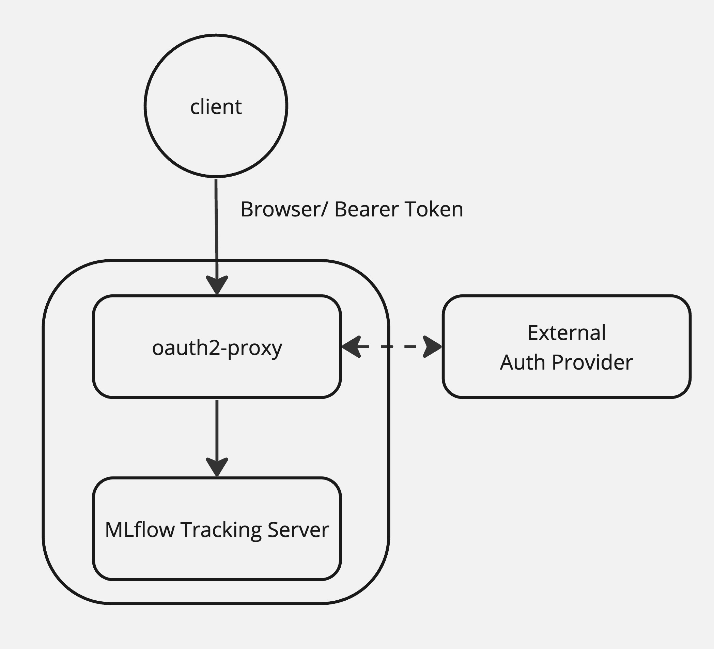

# mlflow-oauth-sidecar
How to authentication in MLflow using an external IDP like Google, Github

## Background
There is an [official instruction](https://mlflow.org/docs/latest/auth/index.html) to authenticate with basic HTTP authentication(username, password) however authenticate using External Providers (Google, GitHub and others) to validate accounts is not supported in MLflow yet. Might have that functionality in Databricks Managed MLflow but not in OSS.

## User Story
- As a: Data Scientists who are involved in ML model development and experimental tracking through MLflow
- I want to: have authentication to access MLflow with external IdP
- So that: can facilitate authentication via their personal accounts and simplify the login process in MLflow

## Architecture
Using oauth2-proxy as a sidecar for MLflow workload that provides authentication using Providers to validate accounts by email, domain or group.



## Implementation

In this [complete example](./docker-compose.yaml), the docker-compose sets up essential MLflow components in your environment. Additionally, it spawn an oauth2-proxy to facilitate authentication with favorite external Identity Provider (IdP).

The example only demonstrates authentication with Google, but you have the flexibility to choose any other external IdPs according to your preferences. For additional details, please refer to the [oauth2-proxy documentation](https://oauth2-proxy.github.io/oauth2-proxy/configuration/oauth_provider)

Before moving on, you should [generate a cookie secrets](https://oauth2-proxy.github.io/oauth2-proxy/configuration/overview#generating-a-cookie-secret) and fill in corresponding [OAuth client ID and secrets](https://oauth2-proxy.github.io/oauth2-proxy/configuration/oauth_provider#google-auth-provider) as environment variables.

```bash
export OAUTH2_PROXY_CLIENT_ID=<oauth_client_id>
export OAUTH2_PROXY_CLIENT_SECRET=<oauth_client_secret>
export OAUTH2_PROXY_COOKIE_SECRET=<proxy_cookie_secret>

docker-compose up -d
```

It might takes a couple of minutes to run the all containers. If you get any error messages, you should check the logs in MLflow and Oauth2-proxy.

Once everything is up, you can access [127.0.0.1:3000](http://127.0.0.1:3000) to login MLflow UI with your email. Also, you can log runs to the tracking server.

Your Bearer token can be retrieved from the browser(Chrome: Developer Tools > Network tab > Response Headers).

```bash
export MLFLOW_TRACKING_URI=http://127.0.0.1:3000 # OAuth2-proxy
export MLFLOW_TRACKING_TOKEN="ey..7w" # Bearer token

python hello-mlflow.py
```

## DEMO

